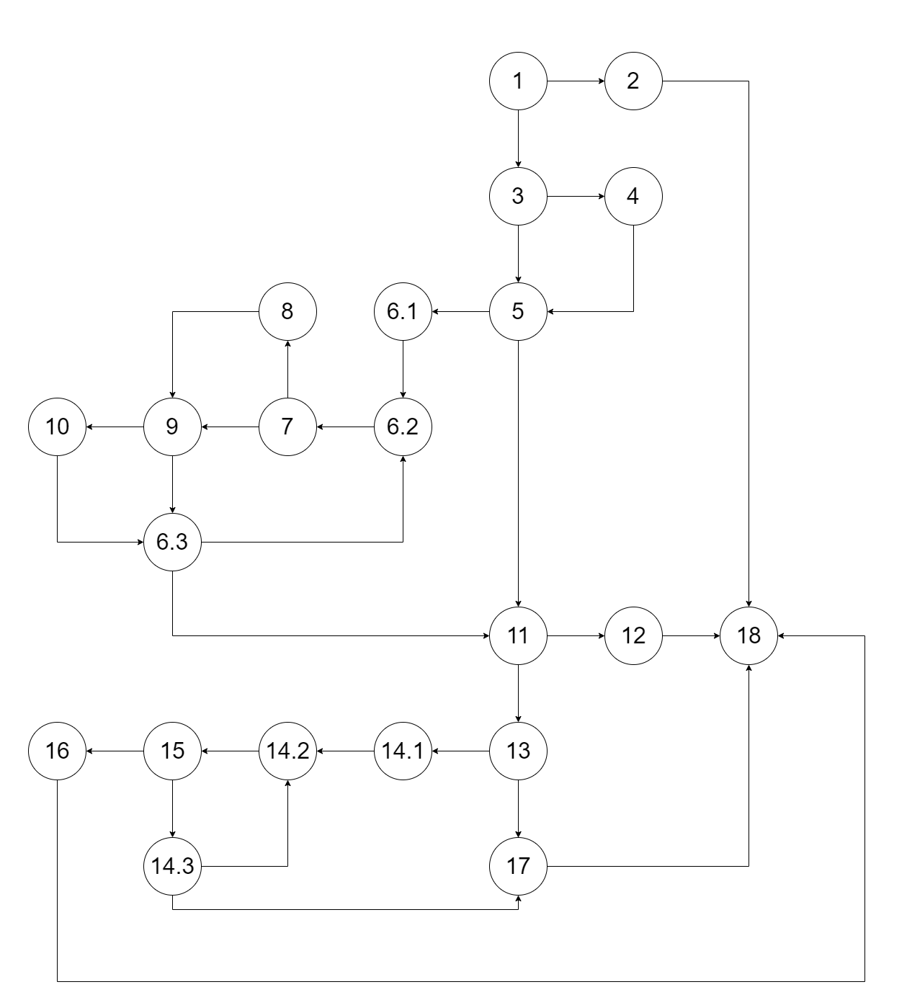
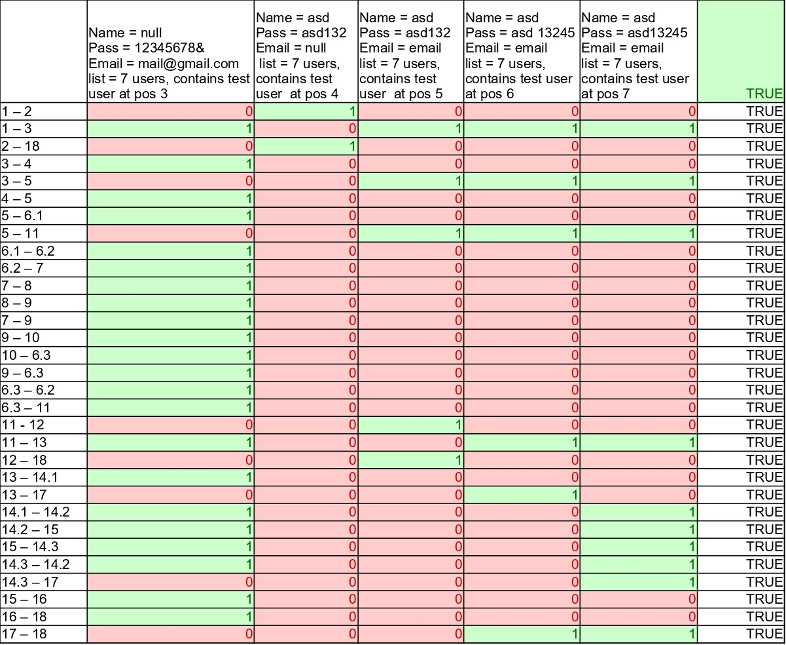

Stefan Pocev 216026

2.

3. Цукломатската комплексност е 11 и се добива со броење на регионите во графот

4.

5.
if (user==null || user.getPassword()==null || user.getEmail()==null)

Може со 4 тест слујаи

user = null\
user.getPassword() = X\
user.getEmail() = X\

user != null\
user.getPassword() = null\
user.getEmail() = X\

user != null\
user.getPassword() != null\
user.getEmail() = null\

user != null\
user.getPassword() != null\
user.getEmail() != null